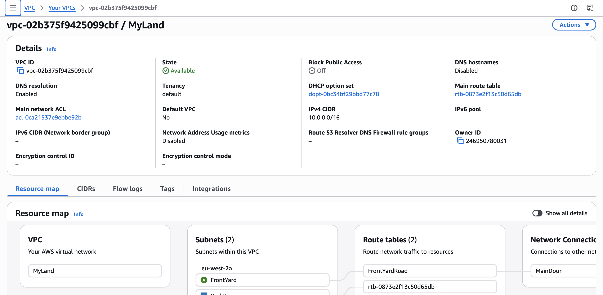
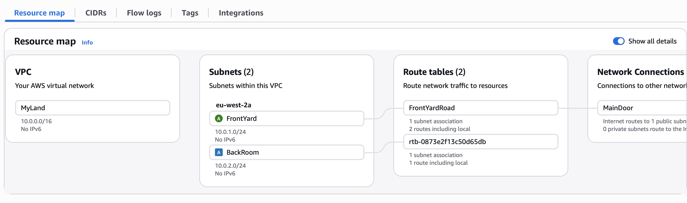
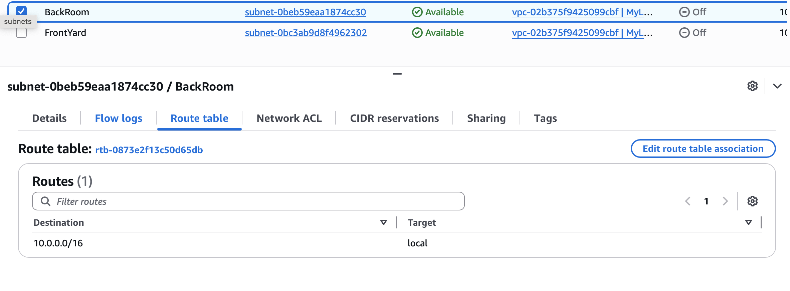
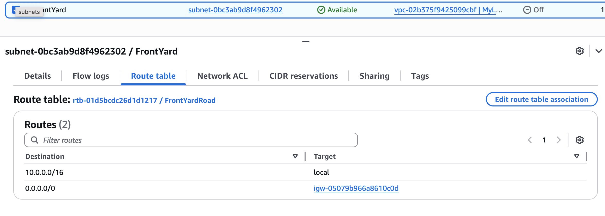
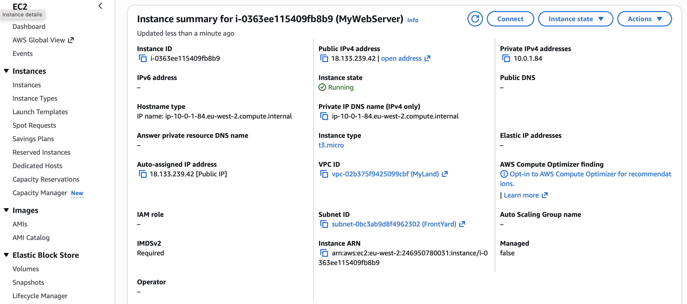
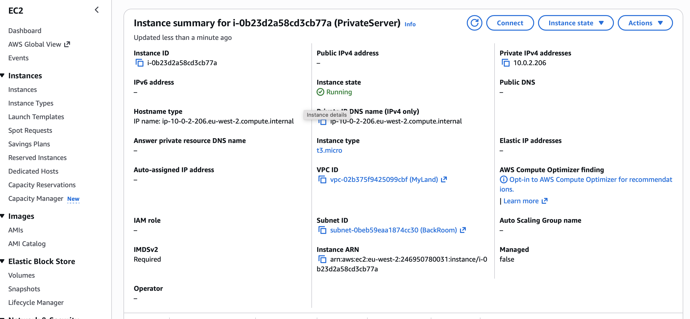
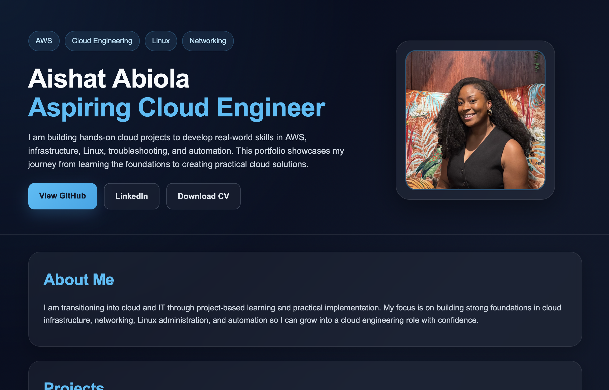

# aws-architecture-project

# 🌐 AWS Secure Cloud Architecture Project

## 🚀 Project Summary
This project demonstrates the design and deployment of a secure, production-style cloud architecture using AWS.

I built a fully functional environment with network isolation, public and private subnets, and a live web server. The aim was to gain hands-on experience with cloud infrastructure, networking, and troubleshooting real-world issues.

---

## 🏗️ Architecture Overview

The architecture consists of:

- **VPC (Virtual Private Cloud):** 10.0.0.0/16  
- **Public Subnet (FrontYard):** 10.0.1.0/24  
- **Private Subnet (BackRoom):** 10.0.2.0/24  
- **Internet Gateway:** Enables external internet access  
- **Route Table:** Configured with `0.0.0.0/0` route for public subnet  

### 🧠 Design Logic
- Public subnet hosts internet-facing resources (web server)
- Private subnet isolates backend resources for security
- Traffic is controlled through routing and security groups

---

## 💻 Technologies Used

- AWS VPC (Networking)
- EC2 (Compute)
- Apache Web Server
- Linux (Amazon Linux)
- SSH for remote access

---

## 🌍 Web Server Deployment

- Deployed an EC2 instance in the public subnet  
- Installed and configured Apache (`httpd`)  
- Created and hosted a custom HTML page  

👉 **Live Site:**  
https://18.133.239.42 

---

## 🔒 Security Configuration

- SSH access restricted to my IP address  
- HTTP (port 80) open to public users  
- Private instance deployed with **no public IP**  
- Network isolation enforced using subnets and routing  

---

## ⚠️ Challenges & Solutions

### 🔧 SSH Connection Issue
**Problem:**  
SSH protocol v.1 not supported  

**Fix:**  
- Used correct SSH command  
- Verified correct username (`ec2-user`)  
- Used EC2 Instance Connect when needed  

---

### 🔧 Apache Not Found
**Problem:**  
`httpd.service not found`  

**Fix:**  
- Checked OS version  
- Installed Apache using correct package manager

## 📸 Screenshots

### VPC

### Subnets

### Route Table

### EC2 Instances

### Live Website

---

## 🧠 What I Learned

- How to build a custom VPC and divide it into public and private subnets
- How route tables and internet gateways control internet access
- How to launch and configure EC2 instances in different subnets
- How security groups control inbound access to cloud resources
- How to install and run a web server on a Linux-based EC2 instance
- How to troubleshoot common cloud issues such as SSH connection errors and missing services

---

## 🔥 Next Steps

- Automate the infrastructure using Terraform
- Add a CI/CD pipeline for faster deployments
- Improve the website frontend with a more polished design
- Add load balancing and auto-scaling for better availability
- Store the project code and documentation in a structured GitHub repository
